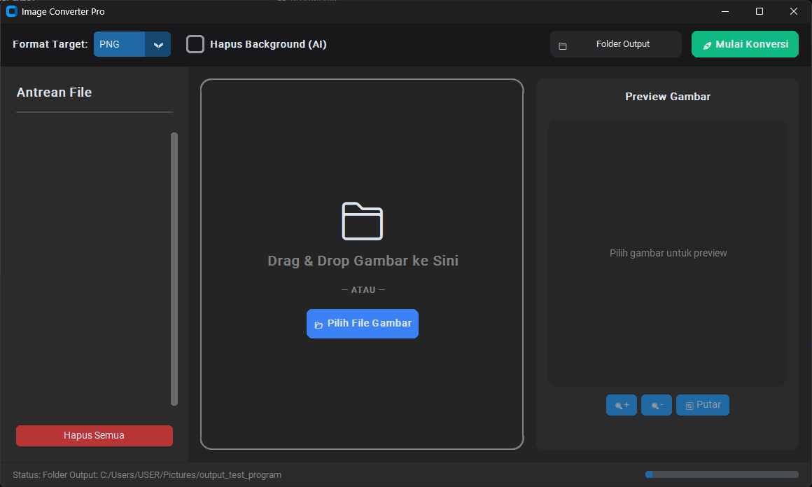

# 🚀 Image Converter Pro


> **Image Converter Pro** adalah aplikasi desktop modern berbasis Python yang dirancang untuk konversi format gambar secara massal (*batch processing*) serta pemotongan latar belakang gambar otomatis menggunakan teknologi **AI Ultra-Precision (birefnet-general)**.

Aplikasi ini dibangun menggunakan **CustomTkinter**, **Pillow**, dan **rembg**, lengkap dengan antarmuka yang responsif, *background thread non-blocking*, fitur privasi metadata, dan kemudahan *drag & drop*.

---

## 📸 Preview



---
<a id="daftar-isi"></a>
## 📑 Daftar Isi

- [✨ Fitur Utama](#fitur-utama)
- [🛠️ Teknologi & Dependensi](#teknologi-dependensi)
- [📁 Struktur Proyek](#-struktur-proyek)
- [📥 Panduan Instalasi & Persiapan](#-panduan-instalasi--persiapan)
- [📖 Panduan Cara Penggunaan Lengkap](#-panduan-cara-penggunaan-lengkap)
- [🔒 Fitur Tambahan & Privasi](#-fitur-tambahan--privasi)
- [📦 Cara Export ke File Executable (.exe)](#-cara-export-ke-file-executable-exe)
- [❓ Troubleshooting & FAQ](#-troubleshooting--faq)
- [🛣️ Roadmap](#-roadmap)
- [📜 Lisensi](#-lisensi)

---
<a id="fitur-utama"></a>
## ✨ Fitur Utama

- 🤖 **AI Background Removal (Ultra Precision):** Menghapus background secara otomatis dengan tingkat akurasi tinggi menggunakan model **birefnet-general**.
- ⚡ **Non-Blocking Batch Processing:** Mengonversi banyak gambar sekaligus di *background thread* tanpa membuat antarmuka (*UI*) membeku.
- 📂 **Dual Drag & Drop Zone:** Menambahkan file cukup dengan menyeret gambar langsung ke aplikasi atau klik tombol browse.
- 🖼️ **Live Preview:** Menampilkan pratinjau gambar dan detail dimensi sebelum diproses.
- 🛡️ **Overwrite Protection:** Mencegah file lama tertimpa dengan otomatis menambahkan penomoran urut (`gambar_1.png`).
- 🧹 **Metadata Cleaner:** Menghapus data EXIF sensitif seperti lokasi GPS, tipe kamera, dan waktu pengambilan foto.
- 📊 **Real-time Progress Bar:** Indikator kemajuan konversi yang akurat dengan animasi reset otomatis setelah proses selesai.
- 🌙 **Modern UI:** Antarmuka bergaya *dark mode* modern berbasis CustomTkinter.

---
<a id="teknologi-dependensi"></a>
## 🛠️ Teknologi & Dependensi

| Komponen | Teknologi / Library | Fungsi |
| :--- | :--- | :--- |
| **Bahasa Utama** | Python 3.10+ | Bahasa pemrograman utama |
| **GUI Framework** | CustomTkinter 5.2.2+ | Antarmuka pengguna bernuansa modern & *dark mode* |
| **Drag & Drop** | TkinterDnD2 0.3.0 | *Library native binding* untuk fitur *drag and drop* |
| **Pengolah Gambar** | Pillow 10.2.0+ | Engine pemroses piksel, transparansi, & konversi format |
| **AI Background** | rembg[cpu] 2.0.57+ | Model AI Ultra-Precision (*birefnet-general*) untuk pemotongan background |
| **AI Runtime** | ONNX Runtime 1.15+ | Runtime eksekusi model AI lokal tanpa GPU wajib |
| **Build Tool** | PyInstaller 6.4.0+ | Mengemas seluruh kode & assets menjadi bundel `.exe` |

---
<a id="-struktur-proyek"></a>
## 📁 Struktur Proyek

```text
Image-Converter-Pro/

├── assets/
|   ├── images
|   ├── icons
|   ├── themes
|   └── logo.ico
├── core/                    # Mesin utama (Core Processing Engine)
│   ├── __init__.py
│   ├── batch.py             # Worker thread untuk batch processing
│   ├── compressor.py        # Logika kompresi & kualitas gambar
│   ├── converter.py         # Konversi Pillow, mode warna, & BiRefNet AI
│   ├── detector.py          # Analisis format & validasi file mentah
│   └── metadata.py          # Ekstraksi & pembersihan EXIF metadata
├── docs/                    # Dokumentasi & aset media README
│   └── images/
│       └── preview.png      # Gambar pratinjau aplikasi
├── gui/                     # Seluruh komponen Antarmuka Pengguna (GUI)
│   ├── __init__.py
│   ├── dialogs.py           # Pop-up dialog notifikasi & konfirmasi
│   ├── dragdrop.py          # Widget area drag & drop + tombol browse
│   ├── main_window.py       # Jendela utama aplikasi & controller UI
│   ├── preview.py           # Panel pratinjau gambar
│   ├── sidebar.py           # Panel samping antrean file
│   ├── splash.py            # Jendela intro (Splash Screen loading)
│   ├── statusbar.py         # Indikator status & progress bar
│   ├── toolbar.py           # Bilah atas (Opsi format, AI, Folder, Convert)
│   └── widgets.py           # Widget kartu item gambar dalam antrean
├── models/                  # Struktur Data (Atribut Gambar)
├── output/
├── plugins/                 # Plugin eksternal / pendukung format
├── services/                # Layer Penghubung (Service Layer)
├── utils/                   # Utilitas, Logger, & Konstanta
├── config.json
├── config.py
├── app.py                   # File utama peluncur aplikasi (Entry Point)
├── requirements.txt         # Daftar dependensi modul Python
└── README.md                # Dokumentasi lengkap proyek
```
---
<a id="-panduan-instalasi--persiapan"></a>
## 📥 Panduan Instalasi & Persiapan

### **Persyaratan Sistem**
- **Sistem Operasi:** Windows 10/11 (64-bit disarankan)
- **Python:** Versi 3.10 atau lebih baru terinstal dan terdaftar pada ```PATH```

### **Quick Installation**

- #### 1. Clone repository ini
```
git clone [https://github.com/username/image-converter-pro.git](https://github.com/username/image-converter-pro.git)
cd image-converter-pro
```
- #### 2. Buat virtual environment
```
python -m venv venv
```

- #### 3. Aktifkan virtual environment (Windows PowerShell)
```
.\venv\Scripts\Activate.ps1
```

- #### 4. Install seluruh dependensi
```
pip install -r requirements.txt
```

- #### 5. Jalankan aplikasi
```
python app.py
```
---
<a id="-panduan-cara-penggunaan-lengkap"></a>
### **📖 Panduan Cara Penggunaan Lengkap**
1. **Jalankan Aplikasi:** Eksekusi ```python app.py``` (Splash screen akan tampil ~1.5 - 3 detik).
2. **Tambahkan Gambar:** Seret (drag & drop) gambar ke kotak tengah atau klik tombol ```📂 Pilih File Gambar```.
3. **Pilih Format Target:** Tentukan format hasil (```PNG```, ```JPEG```, ```WEBP```, ```BMP```) pada toolbar atas.
4. **Aktifkan AI Background Removal (Opsional)** : Centang ```Hapus Background (AI)``` untuk memotong background dengan *BiRefNet.*
5. **Tentukan Folder Output:** Klik ```📁 Folder Output``` untuk memilih lokasi penyimpanan gambar
6. **Mulai Konversi**: Klik tombol hijau ```🚀 Mulai Konversi```.
7. **Selesai**: Ketika gambar telah selesai diproses, maka nantinya akan muncul dialog pemberitahuan bahwa gambar sudah berhasil dikonversi.

---
<a id="-fitur-tambahan--privasi"></a>
## 🔒 Fitur Tambahan & Privasi
- **Pembersihan EXIF Metadata:** Seluruh informasi rahasia seperti lokasi GPS, tanggal pengambilan foto, dan tipe perangkat otomatis dibersihkan pada file keluaran.
- **Handling Transparansi Latar:** Saat gambar berformat RGBA/Transparan dikonversi ke format tanpa *alpha channel* (seperti ```JPEG```), sistem secara cerdas mengganti area transparan dengan latar warna putih bersih.

---
<a id="-cara-export-ke-file-executable-exe"></a>
## 📦Cara Export ke File Executeable (.exe)
#### Gunakan **PyInstaller** untuk mengemas aplikasi menjadi file ```.exe``` yang dapat dijalankan tanpa perlu menginstal Python: 

```
pyinstaller --noconfirm --onedir --windowed --add-data "venv/Lib/site-packages/tkinterdnd2;tkinterdnd2" app.py
```
> #### File hasil konversi executable akan tersimpan di dalam folder ```dist/app/app.exe```.
---
<a id="-troubleshooting--faq"></a>
## ❓ Troubleshooting & FAQ
- **Mengapa proses AI pertama kali terasa lambat?**
> Pada eksekusi pertama kali, pustaka ```rembg``` mengunduh model AI **birefnet-general** sebesar **~500 MB - 1 GB** dari internet. Eksekusi kedua dan seterusnya akan berjalan cepat secara offline karena file model telah tersimpan di komputer lokal (```C:\Users\<Nama_User>\.u2net\```).

- **Mengapa gambar hasil konversi JPEG latar belakangnya menjadi putih?**
> Format ```JPEG``` / ```JPG``` secara teknis tidak mendukung transparansi (*alpha channel*). Jika Anda menghapus background lalu menyimpan sebagai ```JPEG```, area transparan akan otomatis diisi warna putih. Gunakan format ```PNG``` atau ```WEBP``` untuk mempertahankan background transparan.

- **Mengapa fitur Drag & Drop tidak berfungsi?**
> Pastikan Anda menginstal ```tkinterdnd2``` versi ```0.3.0``` dan menjalankan aplikasi melalui class ```CTkTkinterDnD``` pada file ```main_window.py```.

- **Mengapa aplikasi tidak dapat dijalankan di terminal?**
> Pastikan **Python 3.10+** sudah terdaftar di lingkungan ```PATH``` sistem operasi Anda dan *virtual environment* (```venv```) sudah dalam posisi aktif.

---
<a id="-roadmap"></a>
## 🛣️ Roadmap

- ✅ Batch Image Converter

- ✅ AI Background Removal (BiRefNet Ultra Precision)

- ✅ Drag & Drop Integration

- ✅ Live Image Preview

- ✅ Real-time Progress Bar

- ✅ Metadata EXIF Cleaner

- ⏳ GPU Acceleration (CUDA / DirectML support)

- ⏳ Multi-language Support (Bahasa Indonesia & English UI toggle)

- ⏳ HEIC & AVIF Format Support

- ⏳ PDF Batch Export

---
<a id="-lisensi"></a>
<a id="lisensi"></a>
## 📜 Lisensi

[](LICENSE)
[](https://github.com/username/image-converter-pro/releases)

> **Ringkasan Hak:** Bebas digunakan, dimodifikasi, dan didistribusikan baik untuk keperluan pribadi maupun komersial tanpa jaminan (*as-is*).

---

<div align="center">

| 🌟 Menyukai Aplikasi Ini? | 💬 Punya Masukan / Bug? |
| :---: | :---: |
| [](https://github.com/username/image-converter-pro) | [](https://github.com/username/image-converter-pro/issues) |

<br />

Crafted with ❤️ by **[Abraham Roy Rudianto](https://github.com/BramRoyy)**
<br />
*Python • CustomTkinter • Pillow • rembg AI*

</div>

[⬆️ Kembali ke Daftar Isi](#daftar-isi)
